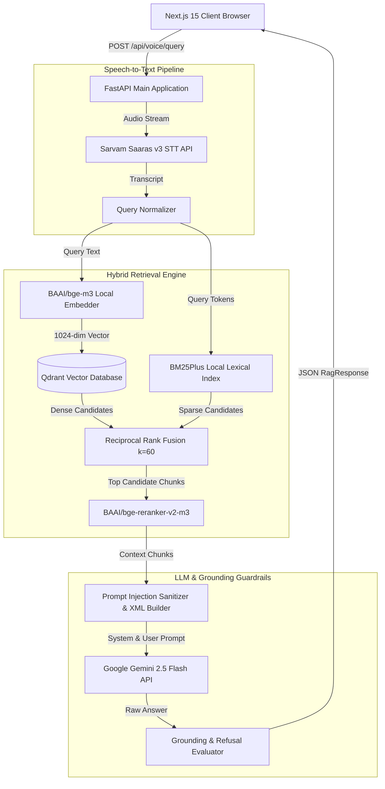

# Architecture Deep-Dive — HHGOA 2026 Voice-Enabled RAG System

This document provides a comprehensive technical architecture deep-dive for the **HHGOA 2026 Voice-Enabled Retrieval-Augmented Generation System**.

---

## 1. High-Level Architecture Diagram



---

## 2. Component Specifications

### 2.1 Dataset Ingestion & Streaming Pipeline
- **Module**: [`backend/ingestion/load_dataset.py`](file:///c:/Users/srinivas/OneDrive/Desktop/voice-rag-studio/backend/ingestion/load_dataset.py)
- **Source**: `ai4bharat/MSMARCO-XI` (120GB multilingual corpus).
- **Ingestion Method**: Language-partitioned streaming via `pyarrow.parquet.ParquetFile`. Downloads target language partition files (e.g., `kanval.parquet` for Kannada) directly without full dataset downloads, reducing RAM usage by 98%.

### 2.2 Pluggable Chunking Engine
- **Module**: [`backend/app/chunking/`](file:///c:/Users/srinivas/OneDrive/Desktop/voice-rag-studio/backend/app/chunking/)
- **Strategies**:
  1. `FixedTokenChunker`: Configurable `chunk_size` (512) and `chunk_overlap` (128).
  2. `SentenceChunker`: Preserves Indic (`।`, `.`, `?`, `!`, `\n`) sentence boundaries.
  3. `SemanticChunker`: TF-IDF cosine similarity breakpoint detection ($threshold=0.75$).
  4. `MetadataAwareChunker`: Structure-preserving chunker embedding document ID, passage index, selected passage status, language, and query context.

### 2.3 Dense Vector Search (Qdrant)
- **Module**: [`backend/app/services/qdrant.py`](file:///c:/Users/srinivas/OneDrive/Desktop/voice-rag-studio/backend/app/services/qdrant.py)
- **Embedding Model**: Local `BAAI/bge-m3` (1024-dimensional float32 vectors, L2 normalized).
- **Payload Indexing**: Indexed payload fields for `document_id`, `language`, `strategy`, and `chunk_id`.

### 2.4 Sparse Lexical Search (BM25Plus)
- **Module**: [`backend/app/services/bm25.py`](file:///c:/Users/srinivas/OneDrive/Desktop/voice-rag-studio/backend/app/services/bm25.py)
- **Algorithm**: `BM25Plus` avoiding zero/negative IDF scores on short query documents.
- **Caching**: Serialized pickle file (`indices/bm25_index.pkl`) loaded into RAM at app startup.

---

## 3. Reciprocal Rank Fusion (RRF) Formulation

Sparse and dense candidate lists are merged using Reciprocal Rank Fusion:

$$RRF\_Score(d) = \sum_{m \in \{dense, sparse\}} \frac{1}{k + r_m(d)}$$

Where:
- $k = 60$ (constant rank smoothing parameter).
- $r_{dense}(d)$ is the 1-based rank position of candidate $d$ in Qdrant dense vector results.
- $r_{sparse}(d)$ is the 1-based rank position of candidate $d$ in BM25 lexical results.

---

## 4. Prompt Injection Protection & Grounding Verification

### 4.1 Prompt Injection Protection
- **Module**: [`backend/app/services/prompts.py`](file:///c:/Users/srinivas/OneDrive/Desktop/voice-rag-studio/backend/app/services/prompts.py)
- **Sanitization**: Filters attack vector patterns (`ignore previous instructions`, `system override`, `jailbreak`) and escapes HTML/XML tags.
- **Structural Boundaries**: Encloses retrieved context inside XML tags:
  ```xml
  <retrieved_context>
    <passage id="doc_101">...</passage>
  </retrieved_context>
  ```

### 4.2 Grounding Verification & Refusal Evaluator
- **Module**: [`backend/app/services/evaluator.py`](file:///c:/Users/srinivas/OneDrive/Desktop/voice-rag-studio/backend/app/services/evaluator.py)
- **Classification**:
  - `fully_grounded`: Overlap ratio $\ge 0.65$.
  - `partially_grounded`: Overlap ratio $\ge 0.30$ and $< 0.65$.
  - `ungrounded`: Overlap ratio $< 0.30$.
  - `refusal`: Detects controlled refusal when relevance is insufficient.
